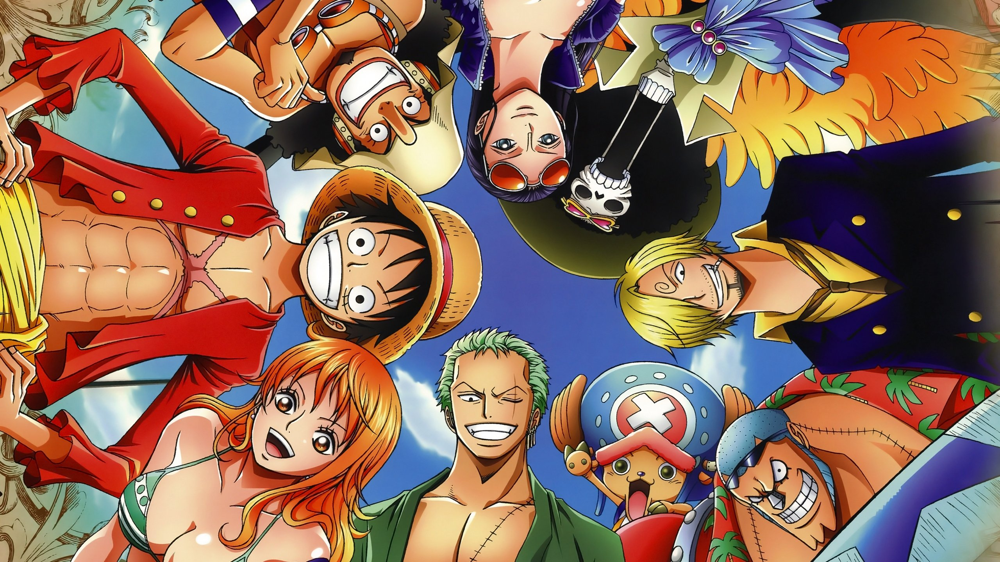
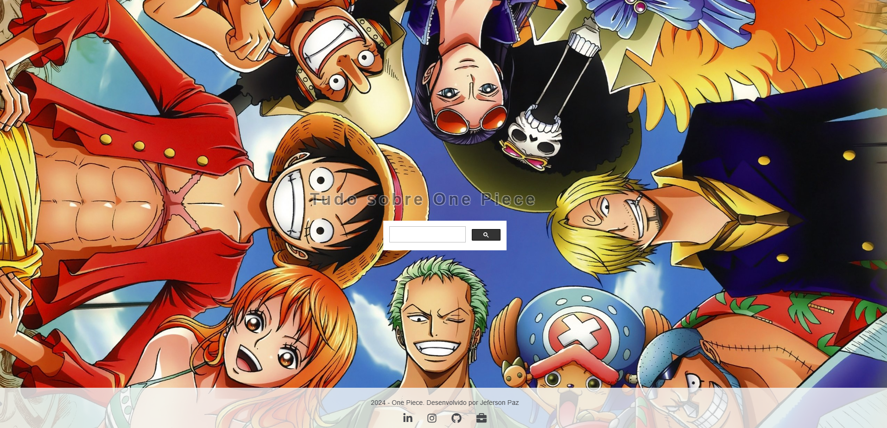

# Projeto One Piece

## Índice
1. [Descrição do Projeto](#descrição-do-projeto)
2. [Estrutura de Arquivos](#estrutura-de-arquivos)
3. [Configuração e Instalação](#configuração-e-instalação)
4. [Uso](#uso)
5. [Tecnologias Utilizadas](#tecnologias-utilizadas)
6. [Funcionalidades](#funcionalidades)
7. [Estilo CSS](#estilo-css)
8. [Como Personalizar](#como-personalizar)
9. [Captura de Tela](#captura-de-tela)
10. [Autor](#autor)

## Descrição do Projeto
Este é um projeto web básico que utiliza HTML e CSS para criar uma página temática sobre *One Piece*. 🏴‍☠️ A página inclui um cabeçalho animado, um campo de busca do Google Custom Search, e um rodapé com links para as minhas redes sociais e o  meu portfólio.



## Estrutura de Arquivos
A estrutura de arquivos do projeto é organizada da seguinte forma:

- `index.html`: Contém a estrutura principal da página. 📄
- `style.css`: Contém os estilos CSS aplicados ao projeto. 🎨
- `/fonts/OnePiece.ttf`: Fonte personalizada usada para os textos da página. 🔤
- `/img/606284.jpg`: Imagem de fundo usada na página. 🖼️

## Configuração e Instalação

1. **Clone o repositório**:
   ```bash
   https://jeferson-paz.github.io/imersao-dev/#gsc.tab=0&gsc.sort=
   ```
2. **Navegue até o diretório do projeto**:
   ```bash
   https://github.com/jeferson-paz/imersao-dev
   ```
3. **Abra o arquivo `https://jeferson-paz.github.io/imersao-dev/#gsc.tab=0&gsc.sort=` no seu navegador**. 🌐

## Uso
Após seguir os passos de instalação, basta abrir o arquivo `https://jeferson-paz.github.io/imersao-dev/#gsc.tab=0&gsc.sort=` no seu navegador de preferência. A página será carregada com um background temático, um título animado e um campo de busca do Google Custom Search. 

- **Busca Google:** Utilize a barra de busca para procurar informações diretamente do Google. 🔍
- **Redes Sociais:** Use os ícones no rodapé para visitar as minhas redes sociais e o meu portfólio. 🌟

## Tecnologias Utilizadas
- **HTML5:** Estrutura da página. 🌐
- **CSS3:** Estilização e animações. 🎨
- **Google Custom Search:** Para funcionalidades de busca na web. 🔎
- **Font Awesome:** Para ícones de redes sociais. 👍

## Funcionalidades
- **Animação de Título:** O título "Tudo sobre One Piece" é animado usando a propriedade `@keyframes`. ✨
- **Busca Integrada:** Implementação do Google Custom Search para pesquisa dentro da página. 🔍
- **Rodapé com Links:** Ícones de redes sociais com links para LinkedIn, Instagram, GitHub e portfólio pessoal. 🌐

## Estilo CSS
O arquivo `style.css` define os estilos usados na página. Aqui estão alguns detalhes importantes:

- **Fonte Customizada:** Usada a fonte OnePiece, que é carregada com a diretiva `@font-face`. 🔤
- **Background:** A imagem de fundo é definida com `background-image`, ajustada para cobrir toda a tela e centralizada com `background-size: cover` e `background-position: center`. 🌄
- **Animação de Título:** A animação é criada com a propriedade `@keyframes moveText`, que faz o título se mover horizontalmente. 🎢

## Como Personalizar
- **Alterar a Fonte:** Substitua `OnePiece.ttf` na pasta `fonts` por outra fonte de sua preferência e atualize o CSS no `@font-face`. 🔤
- **Imagem de Fundo:** Substitua `606284.jpg` na pasta `img` por outra imagem de sua escolha e atualize a propriedade `background-image` no CSS. 🖼️
- **Redes Sociais:** Edite os links dos ícones no rodapé para redirecionar para suas próprias redes sociais. 🌐

## Captura de Tela
**Figura 1**: Captura de tela mostrando a interface do projeto One Piece. 📸



## Vídeo do Projeto

Assista a uma demonstração do projeto em vídeo:

[](video/projeto-one-piece.mp4)

## Autor
**Jeferson Paz** 👋

- [LinkedIn](#https://www.linkedin.com/in/jeferson-paz/) 🔗
- [Instagram](#https://www.instagram.com/jeferson.paz_/) 📸
- [GitHub](#https://github.com/jeferson-paz) 💻
- [Portfólio](#https://jeferson-paz.github.io/Portfolio/) 🌟
